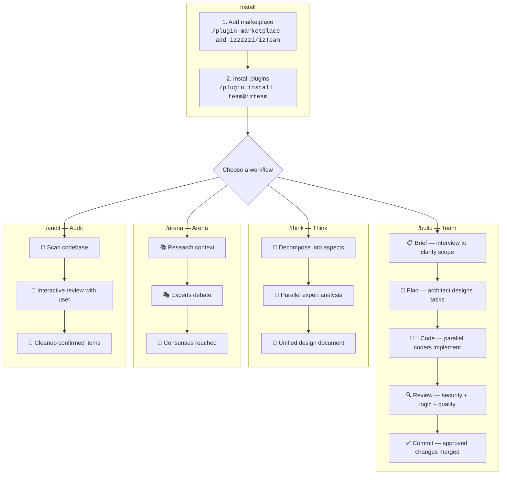

<p align="right"><strong>English</strong> | <a href="./README.ru.md">Русский</a></p>

<div align="center">

# 🧩 izteam

**A Claude Code plugin marketplace for AI agent teams, expert debates, deep planning, and interactive code audits**

[](https://github.com/izzzzzi/izTeam/actions/workflows/validate.yml)
[](https://github.com/izzzzzi/izTeam/actions/workflows/release.yml)
[](https://github.com/izzzzzi/izTeam/actions/workflows/auto-version.yml)
[](https://github.com/izzzzzi/izTeam)
[](LICENSE)
[](CONTRIBUTING.md)
[](https://claude.ai/code)

<br />

*Install focused plugins that make Claude Code more predictable for delivery, decisions, and cleanup.*

</div>

---

## 📖 Overview

**izteam** is an independent plugin marketplace for [Claude Code](https://claude.ai/code).
Each plugin adds slash commands, agents, and ready-to-use workflows: from building features with an AI team to auditing outdated code.

---

## 🗺 How It Works



**Example workflows:**

```bash
# Build a feature with an AI team
/build "Add user settings page with profile editing"

# Think through architecture before coding
/think "Migrate from REST to GraphQL — trade-offs and plan"

# Get expert opinions via structured debate
/arena "Microservices vs monolith for our SaaS?"

# Find and clean up dead code
/audit
```

---

## ✨ Plugins

| Plugin | Version | Description | Command |
|--------|---------|-------------|---------|
| 🤖 **[team](#-team)** | `0.3.4` | Build features with an AI agent team and built-in review gates. | `/build` |
| 🧠 **[think](#-think)** | `1.1.4` | Plan complex tasks before coding with structured expert analysis. | `/think` |
| 🎭 **[arena](#-arena)** | `1.1.4` | Compare expert viewpoints and converge on a clear decision. | `/arena` |
| 🧹 **[audit](#-audit)** | `0.1.6` | Find dead and outdated code with an interactive audit. | `/audit` |

---

## 🚀 Quick Start

### 1. Add the marketplace

```bash
/plugin marketplace add izzzzzi/izTeam
```

### 2. Install plugins

```bash
/plugin install team@izteam
/plugin install think@izteam
/plugin install arena@izteam
/plugin install audit@izteam
```

### 3. Restart Claude Code

Plugins are loaded on startup, so restart after installation.

---

## 🤖 team

Build features with an AI agent team and built-in review gates.

> **Required:** `CLAUDE_CODE_EXPERIMENTAL_AGENT_TEAMS=1` in `settings.json`

```bash
/plugin install team@izteam
```

**Commands:**

```bash
/build "Add user settings page"
/build docs/plan.md --coders=2
/brief "Notifications system"
/conventions
```

**Natural language — also works:**

```
"Build a settings page with profile editing"
"Implement notifications with email and push"
"Interview me before we start building"
"Extract project conventions and document standards"
```

[Read more (EN) →](./plugins/team/README.md) · [RU →](./plugins/team/README.ru.md)

---

## 🧠 think

Plan complex tasks before coding with structured expert analysis.

```bash
/plugin install think@izteam
```

**Commands:**

```bash
/think Implement a feedback collection system with cashback rewards
/think Migrate from REST to GraphQL — trade-offs and strategy
/think Refactor authentication from session-based to JWT
```

**Natural language — also works:**

```
"Think through the architecture for a payments system"
"Plan how to migrate from REST to GraphQL"
"Analyze trade-offs between SSR and CSR"
"Describe a full plan for the microservice"
```

[Read more (EN) →](./plugins/think/README.md) · [RU →](./plugins/think/README.ru.md)

---

## 🎭 arena

Compare expert viewpoints and converge on a clear decision.

> **Required:** `CLAUDE_CODE_EXPERIMENTAL_AGENT_TEAMS=1` in `settings.json`

```bash
/plugin install arena@izteam
```

**Commands:**

```bash
/arena Should we use microservices or monolith for our SaaS?
/arena Best pricing strategy for a developer tool?
/arena How should we handle state management in our React app?
```

**Natural language — also works:**

```
"Debate: microservices vs monolith for our case"
"I need expert opinions on state management"
"Compare Redux vs Zustand vs Jotai — pros and cons"
"What's the best auth strategy? Let experts argue"
```

[Read more (EN) →](./plugins/arena/README.md) · [RU →](./plugins/arena/README.ru.md)

---

## 🧹 audit

Find dead and outdated code with an interactive audit.

```bash
/plugin install audit@izteam
```

**Commands:**

```bash
/audit
/audit features
/audit server
/audit ui
/audit stores
```

**Natural language — also works:**

```
"Find dead code and clean up"
"Clean up the codebase from legacy and orphaned code"
"Check features for unused exports"
"Audit the server for dead API endpoints"
"Find unused UI components"
"Check stores for redundant state"
```

[Read more (EN) →](./plugins/audit/README.md) · [RU →](./plugins/audit/README.ru.md)

---

## 📁 Project Structure

```text
izteam/
├── .claude-plugin/
│   └── marketplace.json
├── plugins/
│   ├── team/
│   ├── think/
│   ├── arena/
│   └── audit/
├── scripts/
│   └── bump-version.sh
├── .github/workflows/
│   ├── validate.yml
│   ├── release.yml
│   └── auto-version.yml
├── CODE_OF_CONDUCT.md
└── CONTRIBUTING.md
```

---

## 🔧 Configuration

### Enable Agent Teams

Plugins `team` and `arena` require the experimental Agent Teams feature:

```json
// ~/.claude/settings.json
{
  "env": {
    "CLAUDE_CODE_EXPERIMENTAL_AGENT_TEAMS": "1"
  }
}
```

---

## 🛠 Development

### Versioning

```bash
# Bump patch version
./scripts/bump-version.sh team patch

# Bump minor version
./scripts/bump-version.sh think minor
```

The script updates `plugin.json` and `.claude-plugin/marketplace.json` together.

### CI/CD

- `validate.yml` — structure and consistency checks
- `release.yml` — release pipeline
- `auto-version.yml` — automatic version bump from Conventional Commits

---

## 🐛 Troubleshooting

- Plugin not visible after install → restart Claude Code.
- New version not picked up → clear cache:

```bash
rm -rf ~/.claude/plugins/cache/izteam/
```

