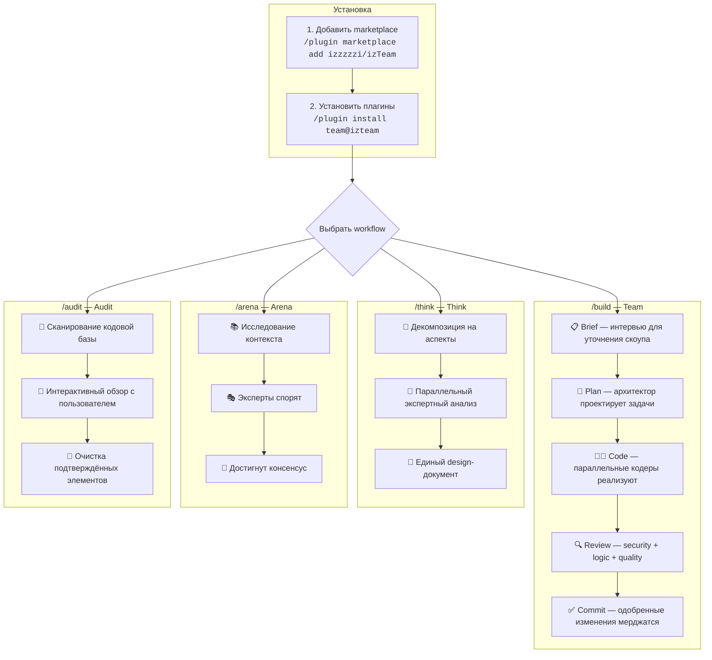

<p align="right"><a href="./README.md">English</a> | <strong>Русский</strong></p>

<div align="center">

# 🧩 izteam

**Маркетплейс плагинов для Claude Code: команды AI-агентов, экспертные дебаты, глубокое планирование и интерактивный аудит кода**

[](https://github.com/izzzzzi/izTeam/actions/workflows/validate.yml)
[](https://github.com/izzzzzi/izTeam/actions/workflows/release.yml)
[](https://github.com/izzzzzi/izTeam/actions/workflows/auto-version.yml)
[](https://github.com/izzzzzi/izTeam)
[](LICENSE)
[](CONTRIBUTING.md)
[](https://claude.ai/code)

<br />

*Установите прикладные плагины, которые делают работу Claude Code предсказуемее для разработки, принятия решений и очистки кода.*

</div>

---

## 📖 Обзор

**izteam** — независимый маркетплейс плагинов для [Claude Code](https://claude.ai/code).
Каждый плагин добавляет slash-команды, агентов и готовые workflow: от реализации фич командой AI-агентов до аудита устаревшего кода.

---

## 🗺 Как это работает



**Примеры использования:**

```bash
# Собрать фичу командой AI-агентов
/build "Добавь страницу настроек пользователя с редактированием профиля"

# Продумать архитектуру до кодинга
/think "Миграция с REST на GraphQL — компромиссы и план"

# Получить мнения экспертов через структурированные дебаты
/arena "Микросервисы или монолит для нашего SaaS?"

# Найти и почистить мёртвый код
/audit
```

---

## ✨ Плагины

| Плагин | Версия | Описание | Команда |
|--------|--------|----------|---------|
| 🤖 **[team](#-team)** | `0.3.7` | Реализуйте фичи с командой AI-агентов и встроенными review-gates. | `/build` |
| 🧠 **[think](#-think)** | `1.1.7` | Планируйте сложные задачи до кодинга через структурированный экспертный анализ. | `/think` |
| 🎭 **[arena](#-arena)** | `1.1.7` | Сравнивайте экспертные точки зрения и приходите к чёткому решению. | `/arena` |
| 🧹 **[audit](#-audit)** | `0.1.10` | Находите мёртвый и устаревший код через интерактивный аудит. | `/audit` |

---

## 🚀 Быстрый старт

### 1. Добавьте marketplace

```bash
/plugin marketplace add izzzzzi/izTeam
```

### 2. Установите плагины

```bash
/plugin install team@izteam
/plugin install think@izteam
/plugin install arena@izteam
/plugin install audit@izteam
```

### 3. Перезапустите Claude Code

Плагины загружаются при старте, поэтому после установки нужен перезапуск.

---

## 🤖 team

Реализуйте фичи с командой AI-агентов и встроенными review-gates.

> **Требуется:** `CLAUDE_CODE_EXPERIMENTAL_AGENT_TEAMS=1` в `settings.json`

```bash
/plugin install team@izteam
```

**Команды:**

```bash
/build "Add user settings page"
/build docs/plan.md --coders=2
/brief "Notifications system"
/conventions
```

**Естественный язык — тоже работает:**

```
"Собери страницу настроек с редактированием профиля"
"Реализуй нотификации с email и push"
"Поспрашивай меня перед тем как начнём строить"
"Выдели конвенции проекта и задокументируй стандарты"
```

[Подробнее (RU) →](./plugins/team/README.ru.md) · [EN →](./plugins/team/README.md)

---

## 🧠 think

Планируйте сложные задачи до кодинга через структурированный экспертный анализ.

```bash
/plugin install think@izteam
```

**Команды:**

```bash
/think Implement a feedback collection system with cashback rewards
/think Migrate from REST to GraphQL — trade-offs and strategy
/think Refactor authentication from session-based to JWT
```

**Естественный язык — тоже работает:**

```
"Продумай архитектуру платёжной системы"
"Спланируй миграцию с REST на GraphQL"
"Проанализируй компромиссы между SSR и CSR"
"Опиши полный план для микросервиса"
```

[Подробнее (RU) →](./plugins/think/README.ru.md) · [EN →](./plugins/think/README.md)

---

## 🎭 arena

Сравнивайте экспертные точки зрения и приходите к чёткому решению.

> **Требуется:** `CLAUDE_CODE_EXPERIMENTAL_AGENT_TEAMS=1` в `settings.json`

```bash
/plugin install arena@izteam
```

**Команды:**

```bash
/arena Should we use microservices or monolith for our SaaS?
/arena Best pricing strategy for a developer tool?
/arena How should we handle state management in our React app?
```

**Естественный язык — тоже работает:**

```
"Дебаты: микросервисы или монолит для нашего кейса"
"Нужны мнения экспертов по управлению стейтом"
"Сравни Redux vs Zustand vs Jotai — плюсы и минусы"
"Какая лучшая стратегия авторизации? Пусть эксперты поспорят"
```

[Подробнее (RU) →](./plugins/arena/README.ru.md) · [EN →](./plugins/arena/README.md)

---

## 🧹 audit

Находите мёртвый и устаревший код через интерактивный аудит.

```bash
/plugin install audit@izteam
```

**Команды:**

```bash
/audit
/audit features
/audit server
/audit ui
/audit stores
```

**Естественный язык — тоже работает:**

```
"Найди мёртвый код и почисти"
"Почисти кодовую базу от legacy и осиротевшего кода"
"Проверь фичи на неиспользуемые экспорты"
"Проведи аудит сервера на мёртвые API эндпоинты"
"Найди неиспользуемые UI компоненты"
"Проверь сторы на избыточный стейт"
```

[Подробнее (RU) →](./plugins/audit/README.ru.md) · [EN →](./plugins/audit/README.md)

---

## 📁 Структура проекта

```text
izteam/
├── .claude-plugin/
│   └── marketplace.json
├── plugins/
│   ├── team/
│   ├── think/
│   ├── arena/
│   └── audit/
├── scripts/
│   └── bump-version.sh
├── .github/workflows/
│   ├── validate.yml
│   ├── release.yml
│   └── auto-version.yml
├── CODE_OF_CONDUCT.md
└── CONTRIBUTING.md
```

---

## 🔧 Настройка

### Включение Agent Teams

Плагины `team` и `arena` требуют экспериментальную функцию Agent Teams:

```json
// ~/.claude/settings.json
{
  "env": {
    "CLAUDE_CODE_EXPERIMENTAL_AGENT_TEAMS": "1"
  }
}
```

---

## 🛠 Разработка

### Версионирование

```bash
# Bump patch version
./scripts/bump-version.sh team patch

# Bump minor version
./scripts/bump-version.sh think minor
```

Скрипт обновляет `plugin.json` и `.claude-plugin/marketplace.json` синхронно.

### CI/CD

- `validate.yml` — проверки структуры и консистентности
- `release.yml` — release pipeline
- `auto-version.yml` — автоматический bump версий по Conventional Commits

---

## 🐛 Troubleshooting

- Плагин не появился после установки → перезапустите Claude Code.
- Новая версия не подтянулась → очистите кеш:

```bash
rm -rf ~/.claude/plugins/cache/izteam/
```

