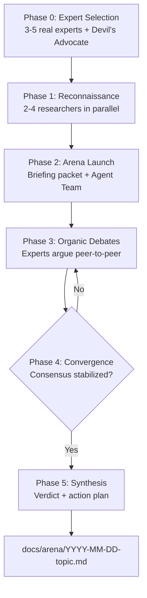

<p align="right"><strong>English</strong> | <a href="./README.ru.md">Русский</a></p>

# Arena

Compare expert viewpoints and converge on a clear decision.

## Prerequisites

> **Agent Teams are experimental and disabled by default.** Enable them before using this plugin.

Add `CLAUDE_CODE_EXPERIMENTAL_AGENT_TEAMS` to your `settings.json` or environment:

```json
// ~/.claude/settings.json
{
  "env": {
    "CLAUDE_CODE_EXPERIMENTAL_AGENT_TEAMS": "1"
  }
}
```

Or set the environment variable:

```bash
export CLAUDE_CODE_EXPERIMENTAL_AGENT_TEAMS=1
```

Restart Claude Code after enabling.

## Installation

```bash
/plugin marketplace add izzzzzi/izTeam
/plugin install arena@izteam
```

## Usage

```
/arena <question>
```

**Examples:**
```
/arena Should we use microservices or monolith for our SaaS?
/arena What's the best pricing strategy for a developer tool?
/arena How should we handle state management in our React app?
```

Works for any domain: engineering, product, strategy, business, science, philosophy.

## How It Works



During debates: experts share positions with self-critique, challenge each other's arguments, change positions when convinced. Devil's Advocate can raise a veto on critical flaws. Moderator provides live commentary on key turns.

## Structure

```
arena/
├── .claude-plugin/
│   └── plugin.json
├── skills/
│   └── arena/
│       ├── SKILL.md
│       └── references/
│           ├── expert-selection-guide.md
│           ├── live-commentary-rules.md
│           └── synthesis-template.md
├── agents/
│   ├── expert.md
│   └── researcher.md
├── README.md
└── README.ru.md
```

## Key Design Principles

| Principle | Why |
|-----------|-----|
| **Real people** | Experts are based on real published viewpoints |
| **Intentional conflict** | Opposing views expose hidden assumptions |
| **Direct communication** | Experts debate peer-to-peer |
| **Position change = strength** | Better arguments can change minds |
| **Devil's Advocate with veto** | Protects against groupthink |
| **Live commentary** | You can follow reasoning in real time |

## When to Use

- High-stakes architecture or strategy decisions
- Trade-offs without an obvious right answer
- Situations where you need diverse expert views
- Stress-testing ideas before committing
- Questions where informed experts may disagree

## License

MIT
