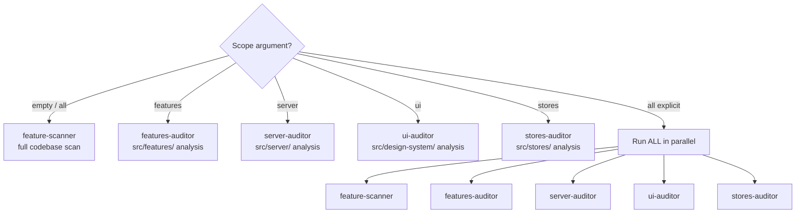

# Vibe Audit — Interactive Feature Cleanup

The audit skill finds potentially dead or experimental code and **asks the user** whether it's still needed.

## Philosophy

In vibe-coding, lots of experimental code gets created. Some becomes core features, some gets abandoned. This skill identifies what's what through **conversation**, not assumptions.

## CRITICAL: AskUserQuestion Rules

**ONE AskUserQuestion per message, then STOP.** This is the most important rule in this skill.

- Never call AskUserQuestion more than once in a single response
- Never make parallel AskUserQuestion calls
- After calling AskUserQuestion — do NOT call any other tool in that response
- Do NOT output text after calling AskUserQuestion
- Wait for the user's response before proceeding

**If you violate this rule, the question gets auto-approved with an empty answer and the user never sees it.**

## Workflow

### Step 1: Discovery

Run the appropriate agent based on scope (see "Scope Options" below):

```
# Default or "all"
Task(audit:feature-scanner) - "Scan codebase for potentially unused features"

# Specific scopes
Task(audit:features-auditor) - "Audit src/features/ for unused exports"
Task(audit:server-auditor) - "Audit src/server/ for unused procedures"
Task(audit:ui-auditor) - "Audit src/design-system/ for orphan components"
Task(audit:stores-auditor) - "Audit src/stores/ for dead Zustand slices"
```

### Step 2: Interactive Review

Loop through findings ONE BY ONE. Each iteration:

1. Output context for the current item as text:

```
📦 **{feature_name}** ({N}/{M})

**Файлы:** {file_list}
**Использование:** {usage_description}
**Последний коммит:** {date}
**Что найдено:** {description}
```

2. Call AskUserQuestion ONCE with exactly 1 question:

```
AskUserQuestion(questions=[{
  question: "Что делаем с {feature_name}?",
  header: "Решение",
  options: [
    {label: "Удалить", description: "Неиспользуемый код — удалить из кодовой базы"},
    {label: "Deprecated", description: "Пометить как deprecated, запланировать удаление"},
    {label: "Оставить", description: "Используется или запланирован к доработке"},
    {label: "Не уверен", description: "Требуется детальный анализ зависимостей"}
  ],
  multiSelect: false
}])

# STOP HERE. Do not call any other tool. Do not output text.
# Wait for user response. Then proceed to item N+1.
```

3. **STOP.** Do not call any other tool. Do not output text after AskUserQuestion. Wait for the user's response.

4. After the user responds — record the decision, then show the next item.

**NEVER ask about item 2 until the user has answered about item 1.**

If the user answers "Не уверен", spawn `audit:usage-analyzer` for that item, show the analysis results, and ask the same question again via AskUserQuestion.

### Step 3: Generate Report

After ALL items are reviewed, output the report:

```markdown
# 🧹 Vibe Audit Report

## Decisions

### 🗑️ To Delete
- [feature] — reason

### ⚠️ Deprecated
- [feature] — remove by: [date]

### ✅ Keep
- [feature] — what it does

## Next Steps
1. [ ] Delete [X] files
2. [ ] Add @deprecated to [Y]
3. [ ] Update documentation for [Z]
```

### Step 4: Final Confirmation

After the report, you MUST get final confirmation before ANY cleanup. Call AskUserQuestion:

```
AskUserQuestion(questions=[{
  question: "Подтвердите удаление {N} элементов. Будет создана резервная ветка перед изменениями.",
  header: "Cleanup",
  options: [
    {label: "Подтвердить", description: "Создать backup-ветку и выполнить удаление"},
    {label: "Отменить", description: "Отложить — сохранить отчёт без изменений"}
  ],
  multiSelect: false
}])

# STOP HERE. Wait for user response.
# "Выполнить" → spawn cleanup-executor for EACH confirmed item.
# "Отмена" → end the session, keep the report.
```

**NEVER skip this step.** Even if the user already answered "Удалить" on individual items, you MUST show the report and get final confirmation.

### Step 5: Merge to Main

After ALL cleanup-executors finish, ask the user:

```
AskUserQuestion(questions=[{
  question: "Cleanup выполнен. Влить cleanup-ветки в основную ветку?",
  header: "Merge",
  options: [
    {label: "Влить в main", description: "Merge и push в основную ветку"},
    {label: "Оставить ветки", description: "Не сливать — оставить для ручной проверки"}
  ],
  multiSelect: false
}])

# STOP HERE. Wait for user response.
```

If user selects "Слить":
1. Determine the main branch name (main or master)
2. For each cleanup branch, run via Task with Bash:
```bash
git checkout {main_branch}
git merge cleanup/{feature_name} --no-ff -m "chore: merge cleanup/{feature_name} into {main_branch}"
```
3. Push: `git push`
4. Proceed to Step 6.

If user selects "Не сливать" → skip to end, report cleanup branches for manual review.

### Step 6: Delete Cleanup Branches

After merge, ask the user:

```
AskUserQuestion(questions=[{
  question: "Cleanup-ветки влиты в main. Удалить отработанные ветки?",
  header: "Branches",
  options: [
    {label: "Удалить ветки", description: "Удалить локально и на remote"},
    {label: "Сохранить", description: "Оставить ветки для истории"}
  ],
  multiSelect: false
}])

# STOP HERE. Wait for user response.
```

If user selects "Удалить", run via Task with Bash for each branch:
```bash
git branch -d cleanup/{feature_name}
git push origin --delete cleanup/{feature_name} 2>/dev/null || true
```

## Scope Options

| Scope | Agent | Target |
|-------|-------|--------|
| **features** | `features-auditor` | `src/features/` — unused exports, dead code |
| **server** | `server-auditor` | `src/server/` — unused tRPC procedures, services |
| **ui** | `ui-auditor` | `src/design-system/` — orphan components |
| **stores** | `stores-auditor` | `src/stores/` — dead Zustand slices |
| **all** | `feature-scanner` | Full codebase scan |

### Agent Selection



## Error Handling

| Situation | Action |
|-----------|--------|
| Scanner agent fails or returns empty | Inform user: "Scan returned no results. Try narrowing scope." Suggest specific directories. |
| Partial scan results | Report what was found. Note which areas were not scanned. |
| Git operations fail in cleanup | Stop cleanup immediately. Report error. Do not proceed with further deletions. |
| TypeScript check fails after deletion | Report which deletion caused the failure. Suggest rollback via git. |
| Project does not use expected stack (no tRPC, no Zustand, etc.) | Adapt scanning patterns to the actual stack. Skip inapplicable auditors. |

## Important Rules

1. **This skill is READ-ONLY.** You MUST NOT delete, edit, or modify any files. You scan, ask, and report. All deletions happen ONLY through cleanup-executor, ONLY after Step 4 final confirmation.
2. **Never delete without confirmation** — even after user answers "Удалить" on individual items, you MUST show the full report and get final confirmation (Step 4) before launching cleanup-executor.
3. **ONE AskUserQuestion per message** — never call AskUserQuestion more than once in a single response. Never make parallel AskUserQuestion calls. After calling AskUserQuestion — do NOT call any other tool or output text. STOP and wait. **This is the most important rule.**
4. **One item per turn** — show one finding, ask one question via AskUserQuestion, STOP. Do not proceed to the next item until the user responds.
5. **Accept "Не уверен"** — some things need more investigation, spawn usage-analyzer
6. **Track decisions** — remember what user said for the report
7. **Bash only for git** — use Bash only for git operations in Steps 5-6 (merge, push, branch delete). For analysis use Read, Grep, Glob.
