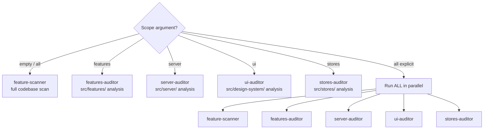

# Vibe Audit — Interactive Feature Cleanup

The audit skill finds potentially dead or experimental code and **asks the user** whether it's still needed.

## Philosophy

In vibe-coding, lots of experimental code gets created. Some becomes core features, some gets abandoned. This skill identifies what's what through **conversation**, not assumptions.

## Workflow

### Step 1: Discovery

Run the appropriate agent based on scope (see "Scope Options" below):

```
# Default or "all"
Task(audit:feature-scanner) - "Scan codebase for potentially unused features"

# Specific scopes
Task(audit:features-auditor) - "Audit src/features/ for unused exports"
Task(audit:server-auditor) - "Audit src/server/ for unused procedures"
Task(audit:ui-auditor) - "Audit src/design-system/ for orphan components"
Task(audit:stores-auditor) - "Audit src/stores/ for dead Zustand slices"
```

### Step 2: Interactive Review

Loop through findings ONE BY ONE. Each iteration of the loop is:
1. Show context for the current item (text output)
2. Call AskUserQuestion ONCE with exactly 1 question about this item
3. STOP. Wait for the user's response. Do NOT call any other tool in this message.
4. After the user responds, proceed to the next item

**NEVER call AskUserQuestion more than once per message.** Do not make parallel AskUserQuestion calls. Do not ask about item 2 until the user has answered about item 1.

```
# For item N of M:

# First, output context as text:
"📦 **{feature_name}** ({N}/{M})
Files: {file_list}
Usage: {usage_description}
Last commit: {date}"

# Then make exactly ONE tool call:
AskUserQuestion(questions=[{
  question: "What should we do with {feature_name}?",
  header: "{feature_name}",
  options: [
    {label: "Delete", description: "This is dead code — remove it"},
    {label: "Deprecated", description: "Remove soon — mark as deprecated"},
    {label: "Keep", description: "This is an active feature — keep it"},
    {label: "Not sure", description: "Needs deeper investigation before deciding"}
  ],
  multiSelect: false
}])

# STOP HERE. Do not call any other tool. Wait for user response.
# After user responds → repeat for item N+1.
```

If the user answers "Not sure", spawn `audit:usage-analyzer` for that item and return to ask again after analysis.

### Step 3: Generate Report

After all questions answered, create action plan:

```markdown
# 🧹 Vibe Audit Report

## Decisions

### 🗑️ To Delete
- [feature] — reason: [user's answer]

### ⚠️ Deprecated
- [feature] — remove by: [date]

### ✅ Keep
- [feature] — document: [what it does]

## Next Steps
1. [ ] Delete [X] files
2. [ ] Add @deprecated to [Y]
3. [ ] Update documentation for [Z]
```

### Step 4: Final Confirmation

After the report is generated, you MUST ask the user to confirm before ANY cleanup:

```
AskUserQuestion(questions=[{
  question: "Ready to execute cleanup? This will delete {N} items listed above.",
  header: "Confirm",
  options: [
    {label: "Execute", description: "Create git backup branch and delete confirmed items"},
    {label: "Cancel", description: "Do nothing — keep the report for later"}
  ],
  multiSelect: false
}])

# STOP HERE. Wait for user response.
# Only if user selects "Execute" → spawn cleanup-executor for EACH confirmed item.
# If user selects "Cancel" → end the session, keep the report.
```

**NEVER skip this step.** Even if the user already answered "Delete" on individual items in Step 2, you MUST ask for final confirmation before executing anything.

## Question Templates

When asking about a feature, provide context:

```
📦 **{feature_name}**

What was found:
- Files: {file_count} ({file_list})
- Usage: {usage_description}
- Last commit: {last_commit_date}
- Dependencies: {dependencies}

Is this needed?
```

## Scope Options

| Scope | Agent | Target |
|-------|-------|--------|
| **features** | `features-auditor` | `src/features/` — unused exports, dead code |
| **server** | `server-auditor` | `src/server/` — unused tRPC procedures, services |
| **ui** | `ui-auditor` | `src/design-system/` — orphan components |
| **stores** | `stores-auditor` | `src/stores/` — dead Zustand slices |
| **all** | `feature-scanner` | Full codebase scan |

### Agent Selection



## Error Handling

| Situation | Action |
|-----------|--------|
| Scanner agent fails or returns empty | Inform user: "Scan returned no results. Try narrowing scope." Suggest specific directories. |
| Partial scan results | Report what was found. Note which areas were not scanned. |
| Git operations fail in cleanup | Stop cleanup immediately. Report error. Do not proceed with further deletions. |
| TypeScript check fails after deletion | Report which deletion caused the failure. Suggest rollback via git. |
| Project does not use expected stack (no tRPC, no Zustand, etc.) | Adapt scanning patterns to the actual stack. Skip inapplicable auditors. |

## Important Rules

1. **This skill is READ-ONLY.** You MUST NOT delete, edit, or modify any files. You scan, ask, and report. All deletions happen ONLY through cleanup-executor, ONLY after Step 4 final confirmation.
2. **Never delete without confirmation** — even after user answers "Delete" on individual items, you MUST show the full report and get final confirmation (Step 4) before launching cleanup-executor.
3. **ONE AskUserQuestion per message** — never call AskUserQuestion more than once in a single response. Never make parallel AskUserQuestion calls. Each response must contain at most one AskUserQuestion call, then STOP and wait. This is the most important rule.
4. **Provide context** — show findings before asking
5. **Accept "not sure"** — some things need more investigation, spawn usage-analyzer
6. **Track decisions** — remember what user said for the report
7. **Do not use Bash** — you have no Bash access. Use only Read, Grep, Glob for analysis and AskUserQuestion for interaction.
