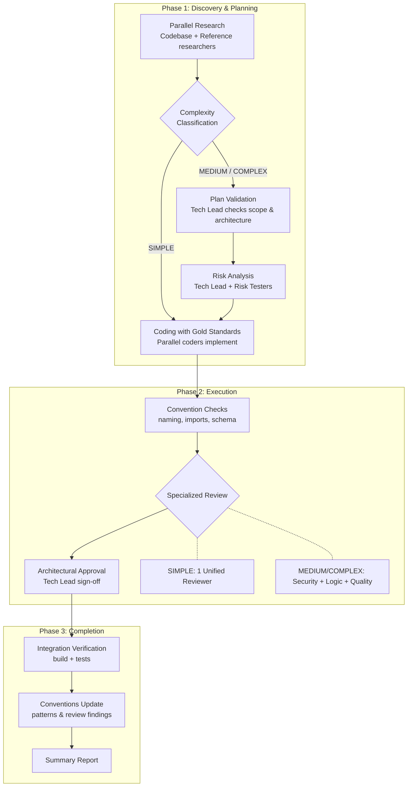

<p align="right"><strong>English</strong> | <a href="./README.ru.md">Русский</a></p>

# Team

Build features with an AI agent team and built-in review gates.

## Prerequisites

> **Agent Teams are experimental and disabled by default.** Enable them before using this plugin.

Add `CLAUDE_CODE_EXPERIMENTAL_AGENT_TEAMS` to your `settings.json` or environment:

```json
// ~/.claude/settings.json
{
  "env": {
    "CLAUDE_CODE_EXPERIMENTAL_AGENT_TEAMS": "1"
  }
}
```

Or set the environment variable:

```bash
export CLAUDE_CODE_EXPERIMENTAL_AGENT_TEAMS=1
```

Restart Claude Code after enabling.

## Installation

```bash
/plugin marketplace add izzzzzi/izTeam
/plugin install team@izteam
```

## Usage

```
/build <description or path/to/plan.md> [--coders=N]
/brief <description> — interview first, then build
/conventions [path/to/project]
```

**Examples:**
```
/build "Add user settings page with profile editing"
/build docs/plan.md --coders=2
/brief "Add notifications"
/conventions
```

## How It Works

### /build

A Team Lead orchestrates the full implementation flow. The pipeline scales with task complexity, so simple work stays fast and complex work gets more review.



| Level | When | What changes |
|-------|------|-------------|
| **SIMPLE** | 1 layer, no behavior changes, <3 tasks | Lightweight team, single reviewer |
| **MEDIUM** | 2+ layers, modifies existing code, 3+ tasks | Full team, specialized reviewers, risk analysis |
| **COMPLEX** | 3+ layers, touches auth/payments, 5+ tasks | Full team + deep analysis and risk testing |

---

### /conventions

Analyzes the codebase and creates/updates `.conventions/` with:
- `gold-standards/` — short exemplary snippets
- `anti-patterns/` — what to avoid
- `checks/` — naming and import rules

`/build` uses these conventions as reference examples. You can also run `/conventions` standalone.

## Complexity Levels

| Level | Team Size | Reviewers | Risk Analysis | Tech Lead Validation |
|-------|-----------|-----------|---------------|---------------------|
| **SIMPLE** | 4 agents | 1 unified | Skipped | Skipped |
| **MEDIUM** | 5-7 agents | 3 specialized | Yes | Yes |
| **COMPLEX** | 6-9+ agents | 3 specialized + deeper scrutiny | Full + risk testers | Yes + user informed on key decisions |

## Team Roles

| Role | Lifetime | Purpose |
|------|----------|---------|
| **Lead** | Whole session | Orchestrates delivery and team flow |
| **Supervisor** | Permanent | Monitors liveness, loops, and escalations |
| **Codebase Researcher** | One-shot | Summarizes structure and conventions |
| **Reference Researcher** | One-shot | Provides high-quality reference files |
| **Tech Lead** | Permanent | Validates plans and architecture |
| **Coder** | Per task | Implements and self-checks |
| **Security Reviewer** | Permanent | Finds exploitable vulnerabilities |
| **Logic Reviewer** | Permanent | Finds correctness and edge-case bugs |
| **Quality Reviewer** | Permanent | Improves maintainability and consistency |
| **Unified Reviewer** | Permanent | All-in-one reviewer for SIMPLE tasks |
| **Risk Tester** | One-shot | Verifies explicit risks with targeted checks |

## Structure

```
team/
├── .claude-plugin/
│   └── plugin.json
├── skills/
│   ├── build/
│   │   ├── SKILL.md
│   │   └── references/
│   │       ├── complexity-classification.md
│   │       ├── risk-analysis-protocol.md
│   │       ├── state-ownership.md
│   │       ├── state-template.md
│   │       ├── summary-report-template.md
│   │       └── teardown-fsm.md
│   ├── brief/
│   │   ├── SKILL.md
│   │   └── references/
│   │       ├── brief-template.md
│   │       └── interview-principles.md
│   └── conventions/SKILL.md
├── agents/
│   ├── supervisor.md
│   ├── codebase-researcher.md
│   ├── reference-researcher.md
│   ├── tech-lead.md
│   ├── coder.md
│   ├── security-reviewer.md
│   ├── logic-reviewer.md
│   ├── quality-reviewer.md
│   ├── unified-reviewer.md
│   └── risk-tester.md
├── references/
│   ├── gold-standard-template.md
│   ├── reviewer-protocol.md
│   ├── risk-testing-example.md
│   ├── status-icons.md
│   └── supervisor-playbooks.md
├── README.md
└── README.ru.md
```

## License

MIT
