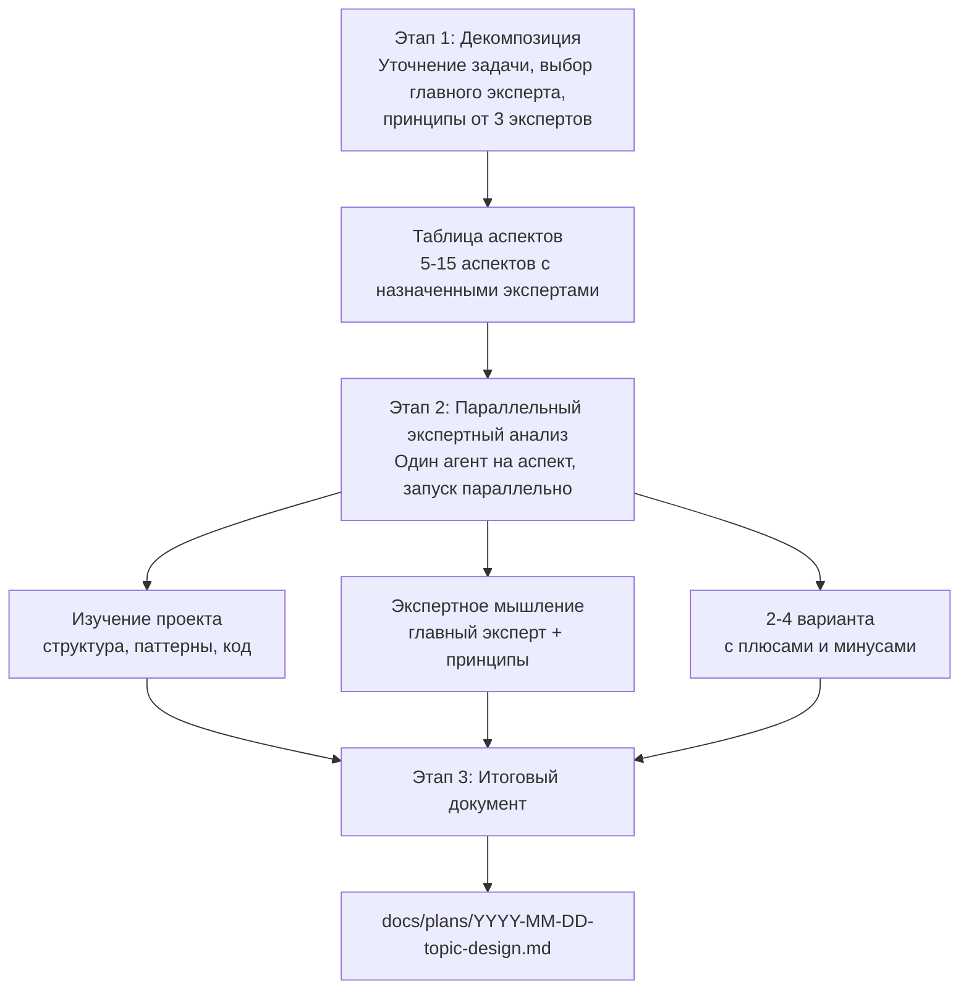

<p align="right"><a href="./README.md">English</a> | <strong>Русский</strong></p>

# Think

Планируйте сложные задачи до кодинга через структурированный экспертный анализ.

## Installation

```bash
/plugin marketplace add izzzzzi/izTeam
/plugin install think@izteam
```

## Usage

```
/think <task or idea>
```

**Example:**
```
/think Implement a feedback collection system with cashback rewards
```

## How It Works



Итоговый документ включает: оглавление, обзор с ключевыми решениями, детали по каждому аспекту с таблицами сравнения, поэтапный план реализации и метрики успеха.

## Structure

```
think/
├── .claude-plugin/
│   └── plugin.json
├── skills/
│   └── think/SKILL.md
├── agents/
│   └── expert.md
├── README.md
└── README.ru.md
```

## Result

Планирующий документ, который включает:
- Список экспертов по разделам
- Таблицы решений
- Примеры кода
- Поэтапный план реализации
- Метрики успеха

## When to Use

- Новые фичи с неочевидными решениями
- Рефакторинг, где есть несколько подходов
- Архитектурные изменения
- Любые задачи, где важно продумать решение до кодинга

## License

MIT
